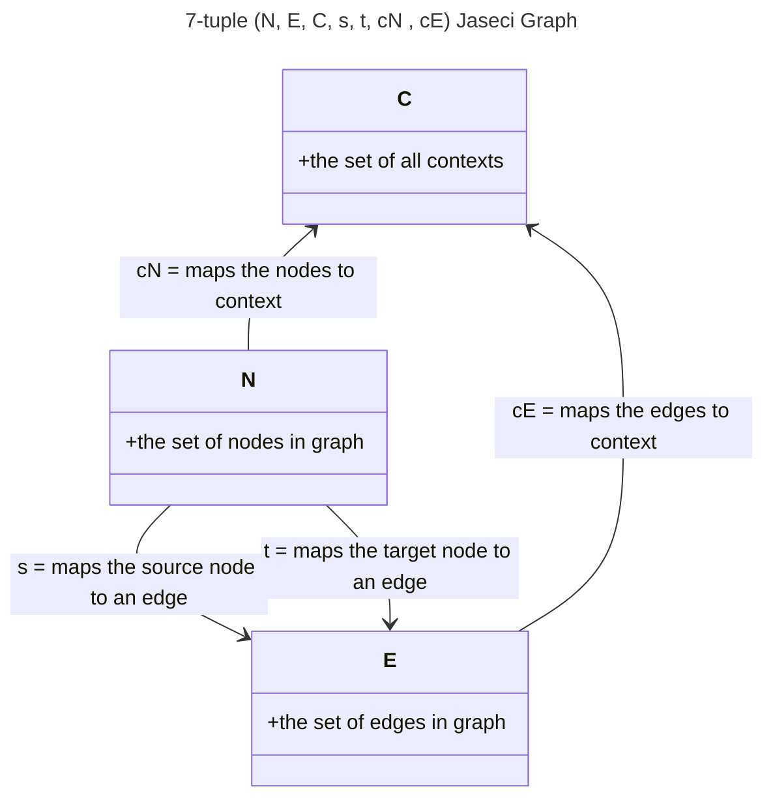
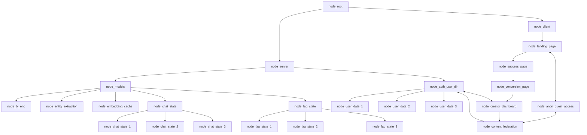
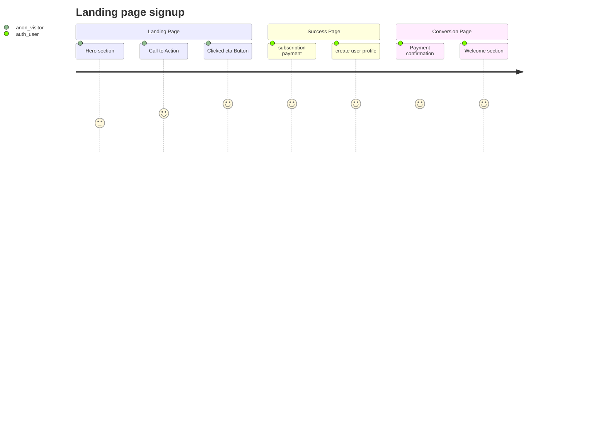
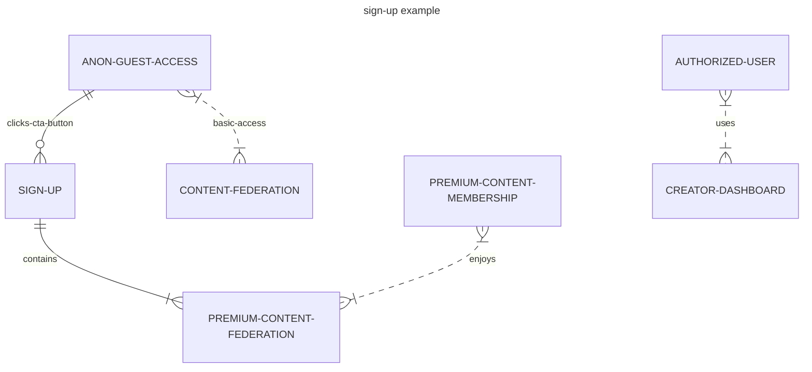

# Apexmite Content Federation - Powered by [Jaseci](https://github.com/Jaseci-Labs/jaseci) and Jac - 🚧 Work In Progress 🏗

<p align="left"> 
 

</p>


Apexmite is a combination of apex and might, and it is more of a title in the realm of cryptids, because the Apexmite (or some refer to this being as the Silverking), but it is the most powerful cryptid, thus being the cryptid at it's apex of might, so I refer to this being as the Apexmite. This is what I am naming the AI Agents Apexmite will be using.


## Apexmite Content Federation - Hero Section, Call to Action - Apexmite Gamified Browser Economics - Skeptics vs Encounter Witness

```yml
Apexmite will be the name of the AI Agent, and if the user chooses to enable AI voice and avatar, Apexmite will read the hero section below:
```

The Apexmite Content Federation is an AI powered Jaseci Progressive Web App (desktop, and mobile app downloads, along with website). Apexmite AI will always be there to help you navigate the Apexmite App, as a fully interactive conversational AI, for those that are anon guests, skeptics, or free tier contributors. Content creators sharing their encounters that wish to purchase Apexmite's full creative capacity with a Pro AI Content Assistant subscription will get to use Apexmite AI Agents with greater creative abilities, or other enhanced capabilties whenever they are released.

With the main growth driver for Apexmite Content Federation being a 50/50 profit share, after business operating costs have been paid, to those that share their _true_ stories of unexplained encounters, of UFO's, Bigfoot, Werewolves, etc.

</img>

</img>

</img>

## If you share your stories with others (I do not mind if you do, please share with others), _but_ they do not share the profits _they_ make _from your story_ this is your content, and I feel _you_ should benefit too, from this encounter of the unexplained that _you_ experienced.

So please, I encourage you to strongly consider sharing your stories of the unexplained with Apexmite Content Federation!

## Are _you_ a skeptic?

</img>

If _you_ think this is all _HOGWASH_, well Apexmite Content Federation encourages _you_ to debunk and _respectfully_ find and expose possible misunderstandings (you must remain respectful at all times when debunking), skeptics will have a higher burden of proof (we don't want your lazy explainations), and will only be rewarded with third party verification of your debunking claims, of hoaxes, misunderstandings, etc. This does give skeptics a chance to earn rewards if they do debunk stories respectfully with strong third party verifiable proof of your counter aurgument for why this is all hogwash.

Bring it skeptics, prove everyone wrong.

I honestly think if couch potato skeptics get outside into the forests, out there digging for real info, they are going to find some things, that may just change their mind about ufos, bigfoot, etc.

</img>

Get out there into the national forests and parks, and find out, those that share their stories of the unexplained are doing their best to explain something they do not fully understand, so they do not have the burden of proof here, it's _YOU SKEPTICS_ that must prove your explainations (and swamp gas ain't gonna cut it here buddy)!

- 50/50 profit share Encounter Witness, free tier
- 50/50 profit share Encounter Witness, Pro AI Content Assistant subscription - monthly or annual - maybe beta access lifetime premium memberships for a one time payment, (a reward for signing up early).
- Skeptic Verified Debunking Reward, flipped profit share, the profit share of debunked stories, will become the property of the skeptic, as their share of the rewards.

Apexmite Content Federation will provide a fiction section for stories that are not true, so please do not create hoaxes because we encourage the skeptics to find hoaxes, it's like a contest or game.

## Technical Details

The structure of the progressive web app, will be in the form of a graph.

[reference: Jaseci Bible](https://github.com/Jaseci-Labs/jaseci/raw/main/support/bible/pdf/jaseci_bible.pdf)

```yml
Jaseci Graph described as a 7-tuple (N, E, C, s, t, cN , cE ), where:
```



- Nodes, edges, and walkers can all have abilities.
  - Abilities cannot interact outside of the context or local variables of the attached node, edge, or walker, and does not have a return.

An example of this would be a maintainer walker saving a user's id and last conversation state for continuing the conversation at a later time.

```yml
Saving state with a maintainer walker:
```

```typescript
can cleanup with talker entry{
    if (!vistor:hoping) {
       spawn *(global.node_conv_root_state) walker::maintainer(
            user_id = visitor.user_id,
            user_context = vistor.user_context,
            dialogue_context = vistor.dialogue_context,
            last_conv_state = vistor.state_for_continuing
            /// @dev Add ERC-4337 account abstractions or any other saved states, etc here.
       );
    }
}
```

- Creating mermaid diagrams as pseudocode:







## Building main.jac file

- Converting the pseudocode into Jac programming language:

```typescript
// import the graph, kb file, and walkers.
import {*} with "./server/models/faq-state/faq_graph.jac";
import {*} with "./server/models/faq-state/ask.jac";
import {*} with "./server/models/faq-state/kb.jac";

/// @notice this walker is reponsible for starting the program.
walker init {
    root {
        server = spawn here ++> graph::faq;
        spawn here walker::ingest_faq(kb_file="main_faq.json");
        while (true){
            spawn here walker::ask;
        }
    }
}
```

- In jaseci 1.4 or later, creating an edge uses the syntax `++>` and referencing an edge uses `-->`.

## I built the faq graph from root, (isolated) as a test

[main4.pdf](https://github.com/WrappedUsername/apexmite-jac/files/11339110/main4.pdf)


- Starting the Redis server

```bash
sudo service redis-server restart
```

- Activating `.venv`

```bash
source .venv/bin/activate
```

## The real Jac programming language syntax highlighting in VS Code


- Training the bi-encoder model with the faq training data.

- Starting the Redis server

```bash
sudo service redis-server restart
```

```bash
actions load module jac_nlp.bi_enc
```

```bash
jac run bi_enc.jac -walk train -ctx '{"train_file": "chat_training_data.json"}'
```

```bash
jac run bi_enc.jac -walk infer -ctx "{\"labels\": [\"Apexmite Content Federation Landing Page\", \"Apexmite Features and Benefits Page\", \"Apexmite Micro-Services Page\", \"Apexmite Creator Dashboard\", \"Apexmite Ad Network Monetization Dashboard\", \"Apexmite Pro AI Content Assistant Subscription Page\", \"Apexmite Pro AI Content Assistant Subscription Pricing Page\"]}"
```

This project's front-end was generated with [Angular CLI](https://github.com/angular/angular-cli) version 15.2.0.
