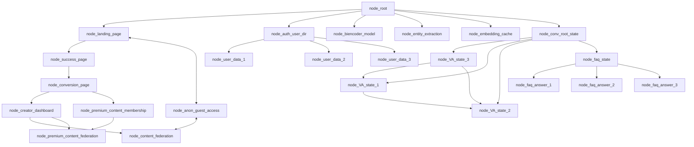
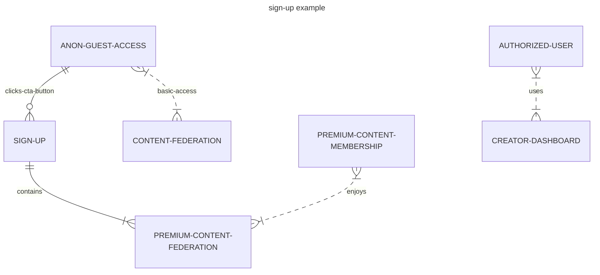

# Apexmite Content Federation - Powered by [Jaseci](https://github.com/Jaseci-Labs/jaseci) and Jac - 🚧 Work In Progress 🏗

<p align="left"> 
 

</p>

Apexmite is a combination of apex and might, and it is more of a title in the realm of cryptids, because the Apexmite (or some refer to this being as the Silverking), but it is the most powerful cryptid, thus being the cryptid at it's apex of might, so I refer to this being as the Apexmite. This is what I am naming the AI Agents Apexmite will be using.

## Apexmite Content Federation - Hero Section, Call to Action - Apexmite Gamified Browser Economics - Skeptics vs Encounter Witness

```yml
Apexmite will be the name of the AI Agent, and if the user chooses to enable AI voice and avatar, Apexmite will read the hero section below: 
```

The Apexmite Content Federation is an AI powered Jaseci Progressive Web App (desktop, and mobile app downloads, along with website). Apexmite AI will always be there to help you navigate the Apexmite App, as a fully interactive conversational AI, for those that are anon guests, skeptics, or free tier contributors. The anon users that choose to purchase a premium content membership, or content creators sharing their encounters that wish to purchase Apexmite's full creative capacity with a Pro AI Content Assistant subscription will get to use Apexmite AI Agents with greater creative abilities, or other enhanced capabilties whenever they are released.

With the main growth driver for Apexmite Content Federation being a 50/50 profit share, after business operating costs have been paid, to those that share their *true* stories of unexplained encounters, of ufos, bigfoot, werewolves, etc.

If you share your stories with others (I do not mind if you do, please share with others), *but* they do not share the profits *they* make *from your story* this is your content, and I feel *you* should benefit too, from this encounter of the unexplained that *you* experienced.

So please, I encourage you to strongly consider sharing your stories of the unexplained with Apexmite Content Federation!

Are *you* a skeptic?

If *you* think this is all *HOGWASH*, well Apexmite Content Federation encourages *you* to debunk and *respectfully* find and expose possible misunderstandings (you must remain respectful at all times when debunking), skeptics will have a higher burden of proof (we don't want your lazy explainations), and will only be rewarded with third party verification of your debunking claims, of hoaxes, misunderstandings, etc. This does give skeptics a chance to earn rewards if they do debunk stories respectfully with strong third party verifiable proof of your counter aurgument for why this is all hogwash.

Bring it skeptics, prove everyone wrong.

I honestly think if couch potato skeptics get outside into the forests, out there digging for real info, they are going to find some things, that may just change their mind about ufos, bigfoot, etc.

Get out there into the national forests and parks, and find out, those that share their stories of the unexplained are doing their best to explain something they do not fully understand, so they do not have the burden of proof here, it's *YOU SKEPTICS* that must prove your explainations (and swamp gas ain't gonna cut it here buddy)!

- 50/50 profit share Encounter Witness, free tier
- 50/50 profit share Encounter Witness, Pro AI Content Assistant subscription - monthly or annual - maybe beta access lifetime premium memberships for a one time payment, (a reward for signing up early).
- Skeptic Verified Debunking Reward, flipped profit share, the profit share of debunked stories, will become the property of the skeptic, as their share of the rewards.

Apexmite Content Federation will provide a fiction section for stories that are not true, so please do not create hoaxes because we encourage the skeptics to find hoaxes, it's like a contest or game.

The structure of the app will be in the form of a graph.

- Creating markdown mermaid diagrams as pseudocode:





## Building main.jac file

- Converting the pseudocode into Jac programming language:

```jac
# import the graph and walker.
import {*} with "./graph.jac";
import {*} with "./walker.jac";

# this walker is reponsible for starting the program.
walker init {

    root {
        /// @notice creates the landing page
        spawn here ++> node::landing_page

        #creates an instant of the graph
        spawn here ++> graph::main_graph;

        #creates an instance of the walker, talker
        spawn  --> walker::talker;
    }
}
```

## Continued in moreREADME folder
