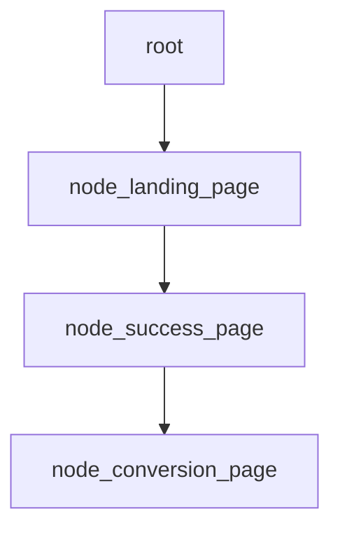

# Apexmite Content Federation - Powered by Jaseci and Jac

- Creating markdown mermaid diagrams as pseudocode:



- Converting that pseudocode into Jac programming language:

```Jac
node landing_page;
node success_page;
node conversion_page

edge anon_guest
edge authorized_user
edge user_id
edge lp_hero_section
edge lp_cta_button_clicked
edge sp_hero_section
edge sp_cta_button_clicked
edge cp_hero_section
edge cp_cta_button_clicked

walker create_app {
    root {
        spawn here ++> node::landing_page
    }
}
```