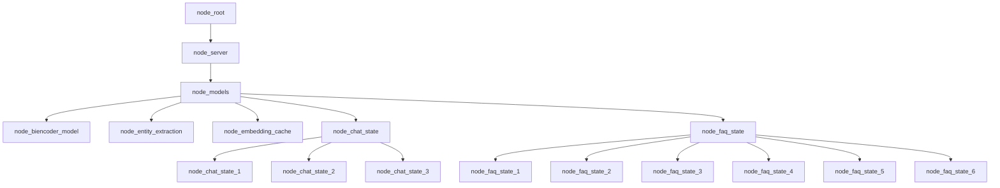

# Building chat_gr.jac file



- Converting the pseudocode into Jac programming language:

```jac
// Defining the nodes
node models;
node chat_state {
    has title;
    has message;
    has prompts;
}

edge transition {
    has intent;
}

// Static graph definition
graph chat {
    has anchor models;
    spawn {
        models = spawn node::models;
        chat_state_1 = spawn node::chat_state(
            title = "Welcome",
            message = "Welcome to Jaseci Dojo, how can i help?",
            prompts = ["class","times","prices","quit"]
        );
    }
}
```
