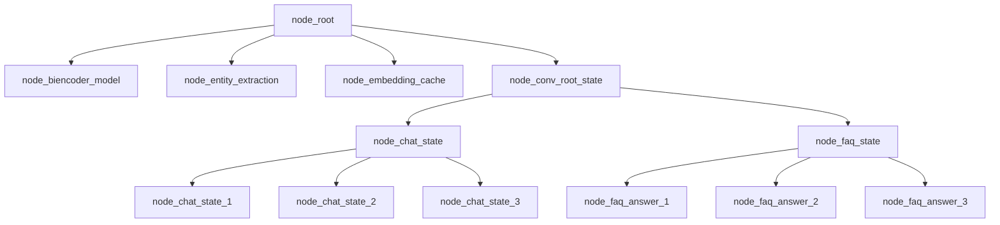

# Building chat_graph.jac file

```mermaid
graph TD;
    node_root-->node_biencoder_model
    node_root-->node_entity_extraction
    node_root-->node_embedding_cache
    node_root-->node_conv_root_state
    node_conv_root_state-->node_chat_state
    node_chat_state-->node_chat_state_1
    node_chat_state-->node_chat_state_2
    node_chat_state-->node_chat_state_3
    node_conv_root_state-->node_faq_state
    node_faq_state-->node_faq_answer_1
    node_faq_state-->node_faq_answer_2
    node_faq_state-->node_faq_answer_3
```

- Converting the pseudocode into Jac programming language:
