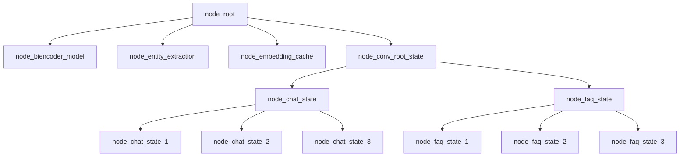

# Building chat_graph.jac file



- Converting the pseudocode into Jac programming language:

```JavaScript
/** 
 * Conversation root state is the name of this node,
 * the majority of the logic is contain in the node abilities,
 * of the conversation root state node. Conversation root sate node abilities,
 * are triggered by talker walker entry and exit.
*/ 
node conv_root_state;
node chat_state {
    has title;
    has message;
    has prompts;
}

/**
 * This is a transition edge, and it has the intent to traverse to the next,
 * node.
*/
edge transition {
    has intent;
}

graph chat_graph {
    has anchor convo_root_state;
    spawn {

        conv_root_state = spawn node::chat_state(
        title = "Welcome",
        message = "Welcome to Apexmite Content Federation, how can I help?",
        prompts = ["TODO_1","TODO_2","prices","quit"]
    );

    prices = spawn conv_root_state +[transition(intent="prices")] +> node::chat_state(
        title = "prices",
        message = "Prices...TODO message",
        prompts = ["TODO_3", "TODO_4" ,"TODO_5", "quit"]
    );

    TODO_3 = spawn TODO +[transition(intent="TODO_3")] +> node::chat_state(
        title = "TODO_3",
        message = "TODO_3",
        prompts = ["TODO_6", "quit"]
    );
        
        TODO_3 +[transition(intent="TODO_6")] +> TODO;

    TODO_4 = spawn TODO +[transition(intent="TODO_4")] +> node::chat_state(
        title = "TODO_4",
        message = "TODO_4",
        prompts = ["TODO_6", "quit"]
    );

        TODO_4 +[transition(intent="TODO_6")] +> TODO;

    TODO_5 = spawn TODO +[transition(intent="TODO_5")] +> node::chat_state(
        title = "TODO",
        message = "TODO",
        prompts = ["TODO_6","quit"]
    );

        TODO_5 +[transition(intent="TODO_6")] +> TODO;

    TODO_1 = spawn conv_root_state +[transition(intent="TODO_1")]+> node::chat_state(
        title = "TODO_1",
        message = "TODO_1",
        prompts = ["TODO_2","TODO_7","prices","quit"]
    );

    TODO_2 = spawn TODO_1 +[transition(intent="TODO_2")]+> node::chat_state(
        title = "TODO_2",
        message = "TODO_1",
        prompts = ["TODO_8","TODO_7","quit"]
    );

        conv_root_state +[transition(intent="TODO_2")] +> TODO_2;

    TODO_8 = spawn TODO_2 +[transition(intent="TODO_8")]+> node::chat_state(
        title = "TODO_2",
        message ="TODO_1",
        prompts = ['TODO_7',"quit"]
    );

    TODO_7 = spawn TODO_2 +[transition(intent="TODO_7")]+> node::chat_state(
        title = "TODO_7",
        message ="TODO_1",
        prompts = ['TODO_2',"quit"]
    );

        TODO_8 + [transition(intent="TODO_7")] +> TODO_7 ;
        TODO_7 + [transition(intent="TODO_2")] +> TODO_2 ;

    }
}
```
