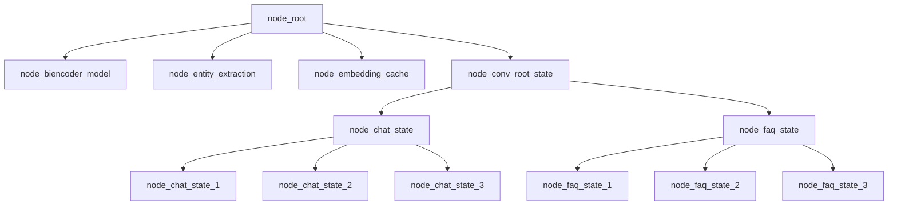

# Building faq_graph.jac file



- Converting the pseudocode into Jac programming language:

```JavaScript
/** 
 * Conversation root state is the name of this node,
 * the majority of the logic is contain in the node abilities,
 * of the conversation root state node. Conversation root sate node abilities,
 * are triggered by talker walker entry and exit.
*/ 
node conv_root_state;
node faq_state {
    has question;
    has answer;
}

/**
 * This is a transition edge, and it has the intent to traverse to the next,
 * node.
*/
edge transition {
    has intent;
}

graph faq_graph {
    has anchor convo_root_state;
    spawn {
        // Spawning the nodes
        conv_root_state = spawn node::faq_state;
        faq_state_1 = spawn node::faq_state(
            question="TODO",
            answer="TODO"
        );
        faq_state_2 = spawn node::faq_state(
            question="TODO",
            answer="TODO"
        );
        faq_state_3 = spawn node::faq_state(
            question="TODO",
            answer="TODO"
        );
    }
}
```
