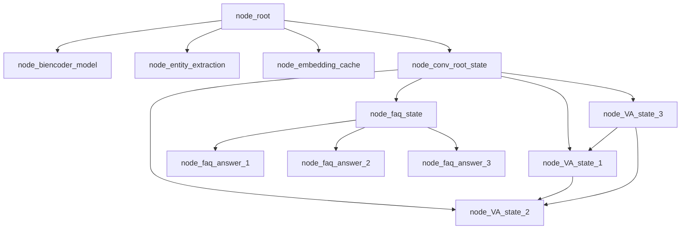

# Building graph.jac file



- Converting the pseudocode into Jac programming language:

```JavaScript
/** 
 * Conversation root state is the name of this node,
 * the majority of the logic is contain in the node abilities,
 * of the conversation root state node. Conversation root sate node abilities,
 * are triggered by talker walker entry and exit.
*/ 
node conv_root_state;
node faq_state {
    has question;
    has answer;
}

edge transition {
    has intent;
}

graph faq_graph {
    has anchor convo_root_state;
}
```
