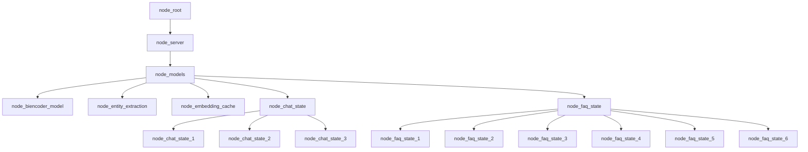

# Building chat_graph.jac file

- Creating mermaid diagrams as pseudocode:



- Converting the pseudocode into Jac programming language:

```jac
// Defining the nodes
node server;
node models;
node chat_state {
    has title;
    has message;
    has prompts;
}

edge transition {
    has intent;
}

// Static graph definition
graph chat {
    has anchor server;
    spawn {
        server = spawn node::server;
        models = spawn node::models;
        chat_state = spawn node::chat_state;
        chat_state_1 = spawn node::chat_state(
            title = "Welcome",
            message = "Welcome to Apexmite, how can I help?",
            prompts = ["TODO","TODO","prices","quit"]
        );

        // Connecting the nodes together
        server ++> models;
        models ++> faq_state;
        faq_state ++> faq_state_1;
        faq_state ++> faq_state_2;
        faq_state ++> faq_state_3;
        faq_state ++> faq_state_4;
        faq_state ++> faq_state_5;
        faq_state ++> faq_state_6;
    }
}

walker init {
    root {
        spawn here ++> node::models;
    }
}
```
