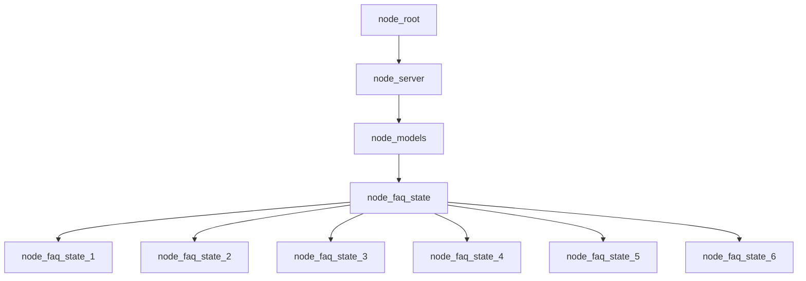

# Building faq_graph.jac file



- Converting the pseudocode into Jac programming language:

```typescript
// Defining the nodes
node server;
node models;
node faq_state {
    has question;
    has answer;
}

// Static graph definition
graph faq {
    has anchor server;
    spawn {
        server = spawn node::server;
        models = spawn node::models;
        faq_state = spawn node::faq_state;
        faq_state_1 = spawn node::faq_state(
            question="What is Apexmite?",
            answer="TODO"
        );
        faq_state_2 = spawn node::faq_state(
            question="TODO",
            answer="TODO"
        );
        faq_state_3 = spawn node::faq_state(
            question="TODO",
            answer="TODO"
        );
        faq_state_4 = spawn node::faq_state(
            question="TODO",
            answer="TODO"
        );
        faq_state_5 = spawn node::faq_state(
            question="TODO",
            answer="TODO"
        );
        faq_state_6 = spawn node::faq_state(
            question="TODO",
            answer="TODO"
        );

        // Connecting the nodes together
        server ++> models;
        models ++> faq_state;
        faq_state ++> faq_state_1;
        faq_state ++> faq_state_2;
        faq_state ++> faq_state_3;
        faq_state ++> faq_state_4;
        faq_state ++> faq_state_5;
        faq_state ++> faq_state_6;
    }
}

walker init {
    root {
        spawn here ++> node::models;
    }
}
```
